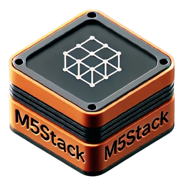
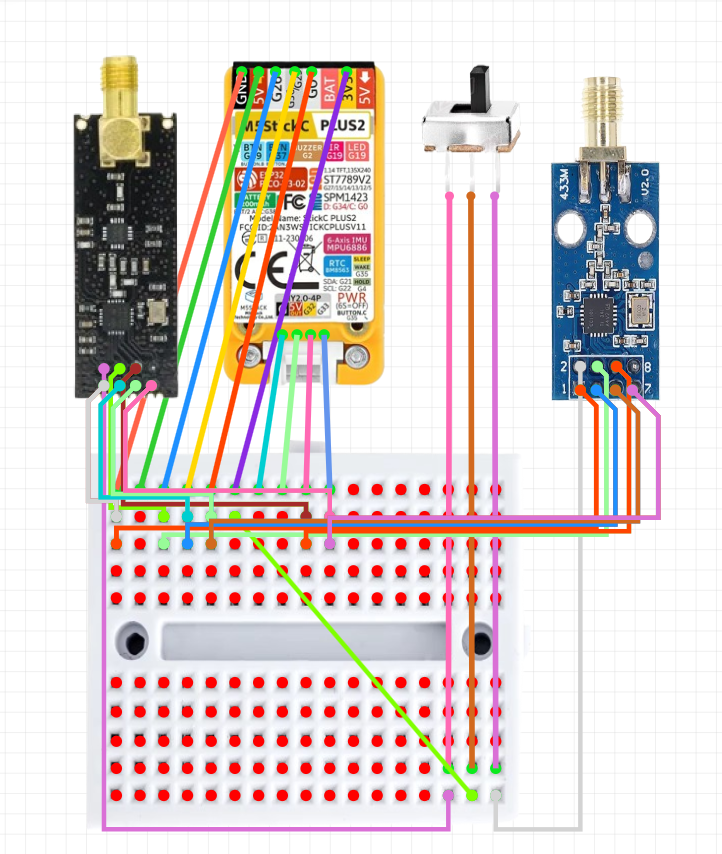
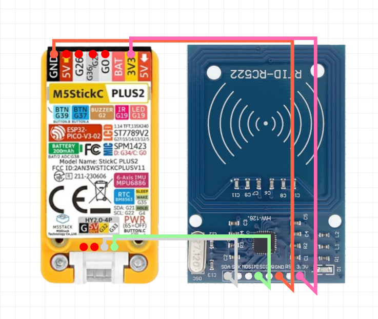
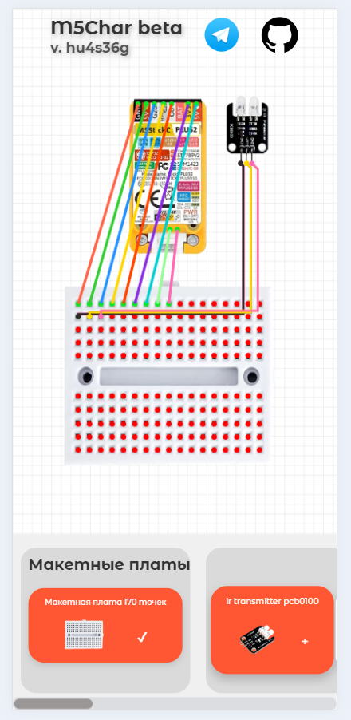

# m5char.ru
Разработчики:
@MikDoOffical
Спонсоры:
@kirushaaa

Тг канал:
https://t.me/m5Char

🌐⚙️ Онлайн-платформа для любителей электроники! Подключай 🛠️ модули через макетную плату к компактному M5 StickC Plus2 🖥️. Твори 🤖, экспериментируй 🔬, делись проектами 💡. Легко, быстро и интересно!

Хочешь что то добавить?
Пиши:
[Форма](https://docs.google.com/forms/d/e/1FAIpQLScYzhDQdUULVjR_GbhjXMFLi2kBx4P7qMqolmuJbrCJx2FgTQ/viewform?usp=header)

✨ Скоро выйдет новое обновление! 🚀
----------------------------------------------------------------

✨ **Обновление v.hx8t60k** 🎉  

🔥 **Что нового?**  

- ✨ **Добавлено**:  
  поддержка модулей **nRF24** 📡 и **CC1101** 📶  
- 🛠️ **Исправлено**:  
  подключение для **Micro SD** 💾  

  

**🎄 С Новым годом! ✨  
Пусть в этом году ваши проекты будут вдохновляющими, а технологии всегда на шаг впереди! Успехов, творчества и исполнения всех задумок! 🎆🎉**  

----------------------------------------------------------------

Прошлое обновление v.hx7t52j 🎉

🔥 Что нового?

🛠️ Модули добавлены:  
📡 IR Receiver  
💡 Laser KY-008  
🔌 USB CH9329  
📀 RC522  

🔗 Подключение к стику напрямую 🔌  
🐞 Фиксы багов — ошибки исправлены.

----------------------------------------------------------------

Прошлое обновление v.hu4s36g 🎉

🔥 Что нового?

Адаптация для телефона: Теперь ваш проект работает и на мобильных устройствах! 📱🎉
Новый алгоритм цветов проводов: Проводам теперь придаются новые цвета для более легкого распознавания и улучшенной визуализации! 🌈🔌

💡 Дополнительные улучшения:
Сделано больше улучшений для удобства пользователя. Все изменения направлены на повышение эффективности и качества работы вашего устройства. 🚀
Интерфейс стал еще более понятным и адаптированным для разных типов экранов. 🖥️📲

----------------------------------------------------------------

Прошлое обновление v.43fc5h1 🎉

🔥 Что нового?

Добавлены модули:

📡 IR Transmitter PCB0100

📡 IR Transmitter HX-53

📡 KY-022

📡 Nrf24L01

💾 TF Module

💾 SD Micro Module

📶 CC1101 433MHz SMA

🛠️ PN532

Основное устройство:
🖥️ StickC Plus2

Дополнительно:

🔗 Макетные платы на 170 точек (беспаечные).

🖼️ 2D пространство для визуализации и интеграции модулей.

Создавай, подключай и воплощай идеи! 🚀

